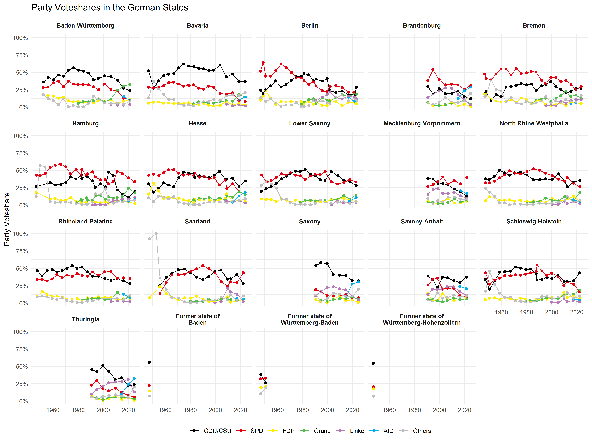
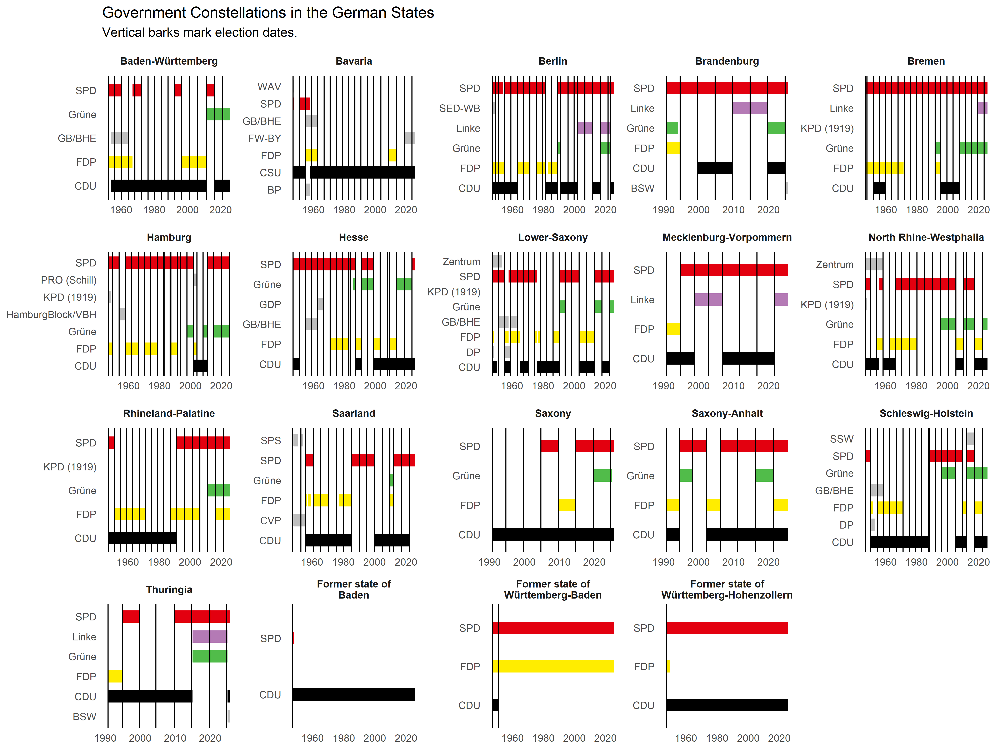

<!-- README.md is generated from README.Rmd. Please edit that file -->

# bundeslaendeR 

<!-- badges: start -->
[](https://github.com/RStelzle/bundeslaendeR/actions)
<!-- badges: end -->

The goal of `bundeslaendeR` is to provide easy and cleaned up access to
data regarding election results as well as government constellations in
the German states.

Todo:

-   [x] Keep data up to date. (LTW Sachsen-Anhalt 2021 missing)

-   [x] Add information of Ministerpräsidenten name and party to
    government data

-   [ ] Clean up gov\_end\_dates. Linhart et al stop with election date
    most of the time, wikipedia with election of new cabinet in the
    Landtag.

-   [ ] Link my party-within-election observations with IDs for state
    parties’ manifestos form polidoc.net

-   [ ] Link governments to coalition agreements from polidoc.net

-   [ ] Provide non R outputs for the data (csv, dta)

-   [ ] Provide a nicer pdf version of a codebook

Maybe:

-   [ ] Provide cleaned up version of only the election totals & add
    some more (ENP, etc.)

-   [ ] Add information of cabinet type to government data. (Not sure if
    this is a good idea. I can only get to the status within the
    legislature not to factors external to this that are needed to
    provide Woldendorp et al.-esque information on the type of
    government)

-   [ ] Provide cleaned up version of only the government data

## Installation

(While the project is still under development in a private repository, I
didn’t manage to get it installed using `git2r`. Thus, I would recommend
cloning the repository and installing the package using
`R devtools::install_local()` from within the cloned repository)

Install the development version from [GitHub](https://github.com/) with:

``` r
# install.packages("devtools")
devtools::install_github("RStelzle/bundeslaendeR")
```

## Example

### Here is a quick example showing access to the election results:

<details>
<summary>
Show Code:
</summary>

``` r
library(tidyverse)

library(bundeslaendeR)


ltw_election_results %>% 
  select(state_name_en, election_date, partyname_short, party_vshare) %>% 
  mutate(partyname_short = case_when(
    partyname_short %in% c("SPD", "FDP", "Grüne", "Linke", "AfD") ~ partyname_short,
    partyname_short %in% c("CDU", "CSU") ~ "CDU/CSU", 
    TRUE ~ "Others"
         )) %>% 
  mutate(partyname_short = as_factor(partyname_short) %>% 
                            fct_relevel("CDU/CSU", "SPD", "FDP", "Grüne", "Linke", "AfD", "Others")) %>%
  mutate(state_name_en = str_replace(state_name_en, "former state ", "Former state of\n") %>% 
                          fct_reorder(str_detect(., "Former state"))) %>% 
  group_by(state_name_en, election_date, partyname_short) %>% 
  summarise(party_vshare = sum(party_vshare)) %>% 
  ungroup() %>% 
  ggplot(aes(x = election_date, y = party_vshare, col = partyname_short)) +
    geom_point() +
    geom_line() +
    facet_wrap(~state_name_en) +
    scale_color_manual(values = c("black", "#E3000F", "#ffed00", "#51bc4a", "#b47ab5", "#00adef", "grey"),
                       guide = guide_legend(nrow = 1)) +
    scale_y_continuous(labels = scales::percent) +
    theme_minimal() +
    theme(strip.text = element_text(face = "bold"),
          legend.position = "bottom") +
    labs(x = NULL,
         y = "Party Voteshare",
         col = NULL,
         title = "Party Voteshares in the German States")
```

</details>

<br><br>



### Here is a quick example showing the government compositions across time in all states.

<details>
<summary>
Show Code:
</summary>

``` r
library(ggfocus)


ltw_election_results_and_gov %>% 
  select(state_name_en, election_date, partyname_short,
         gov_party, gov_start_date, gov_end_date) %>% 
  filter(gov_party == TRUE) %>% 
  mutate(gov_end_date = case_when(
      gov_end_date == as.Date("2999-12-31") ~ Sys.Date(),
      TRUE ~ gov_end_date
    )) %>% 
  mutate(state_name_en = str_replace(state_name_en, "former state ", "Former state of\n") %>% 
                            fct_reorder(str_detect(., "Former state"))) %>% 
  ggplot(aes(col = partyname_short)) +
    geom_segment(aes(x = gov_start_date, xend = gov_end_date,
                     y = partyname_short, yend = partyname_short),
                 size = 5) +
    geom_vline(data = . %>% select(election_date, state_name_en) %>% distinct(),
               aes(xintercept = election_date)) +
    facet_wrap(~state_name_en, scales = "free") +
    scale_color_focus(focus_levels = c("CDU", "CSU", "SPD", "FDP", "Grüne", "Linke"), 
                      color_focus = c("black", "black", "#E3000F", "#ffed00", "#51bc4a", "#b47ab5"),
                      color_other = "grey") +
    theme_minimal() +
    theme(strip.text = element_text(face = "bold"),
          legend.position = "none",
          panel.grid.major = element_blank(),
          panel.grid.minor = element_blank()) +
    labs(x = NULL,
         y = NULL,
         title = "Government Constellations in the German States",
         subtitle = "Vertical barks mark election dates."
         )

```

</details>

<br><br>


